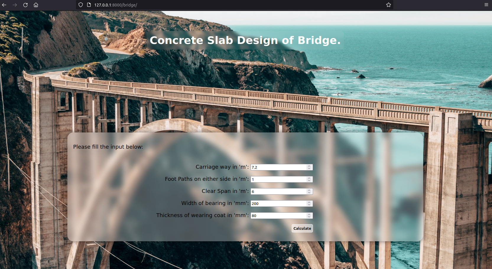
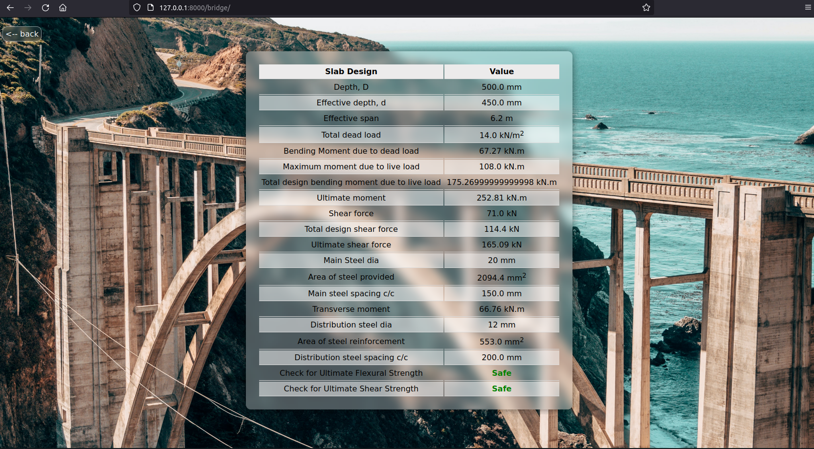

# RCC-Bridge-Slab-Design
Web Application to design RCC Bridge Slab using Python and Django.

<br><br>

### Dependencies
```Bash
pip install Django
```

<br><br>

### Demo
---
```Shell
[~/bdesigner/]> python manage.py runserver
--Snip--
Django version 4.1.3, using settings 'bdesigner.settings'
Starting development server at http://127.0.0.1:8000/
Quit the server with CONTROL-C.
```

Open the following URL in the browser: `http://127.0.0.1:8000/bridge`

<br><br>


<br><br>

